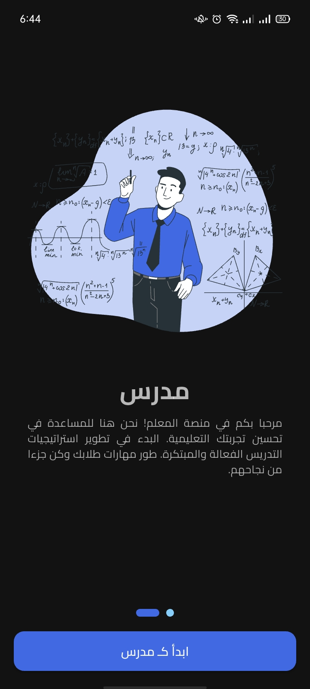
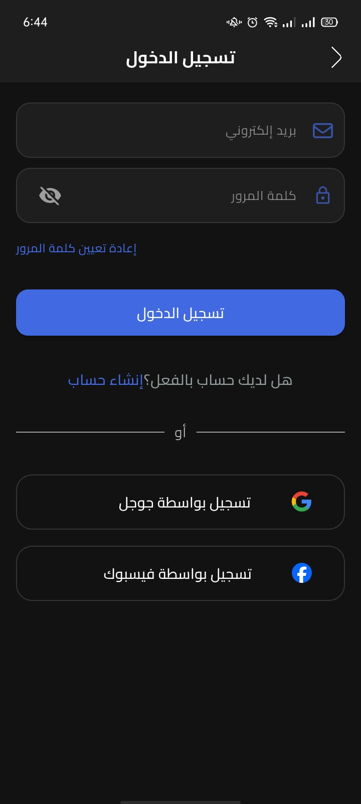
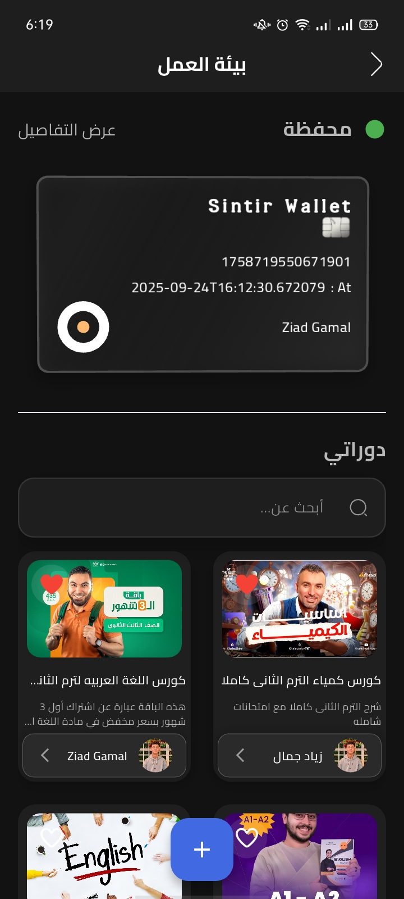
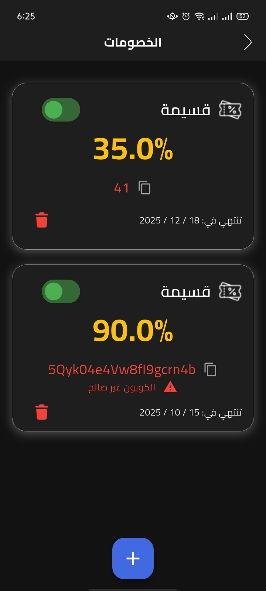
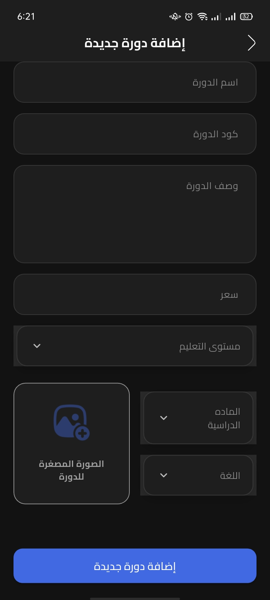
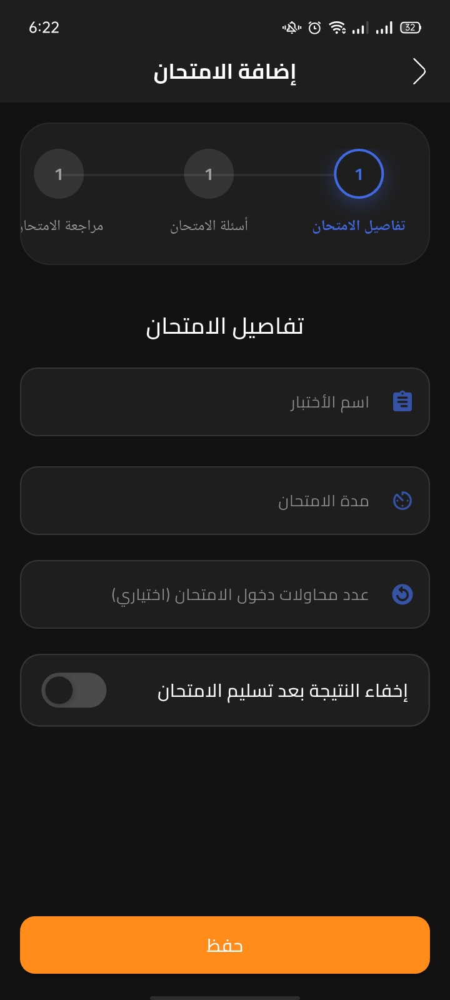
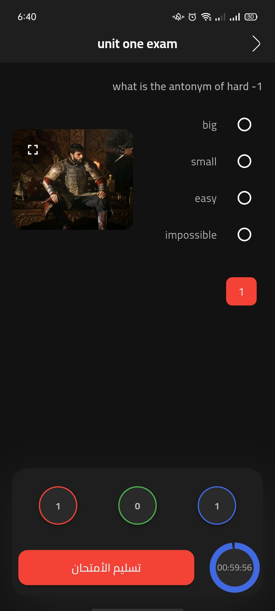
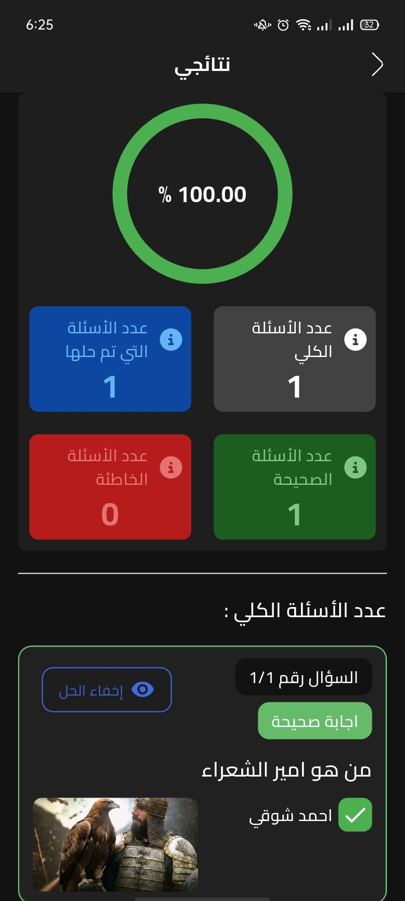

# 🎓 Sintir

**A digital learning platform connecting teachers and students — course management, live content, exams, and progress tracking, all in one app.**

Sintir simplifies digital education for both students and teachers through a modern, organized, and easy-to-use experience. Teachers can create and manage courses, upload lectures and exams, and track student performance. Students can browse courses, take exams, track their results, and follow their learning journey — all in one place.

---

## 📱 Screenshots

| Select Sign-in Role | Sign In as Student | Home Page |
|:---:|:---:|:---:|
|  |  |  |

| Search Page | Wallet Page | Coupons |
|:---:|:---:|:---:|
|  |  |  |

| Add Course | Add Exam | Taking an Exam |
|:---:|:---:|:---:|
|  |  |  |

| Result After Exam |
|:---:|
|  |

---

##  Features

### For Students
- Browse and search courses with advanced filters (price, subscription status, education level, sorting)
- Save favorite courses
- Enroll in and access course content (videos, files, exams)
- Take timed exams with question navigation and submission tracking
- View detailed results and performance analytics
- Review personal mistakes with correct answers highlighted
- Rate and review teachers
- Track subscriptions and manage account details

### For Teachers 
- Create and manage courses (title, description, price, subject, education level, language)
- Organize content by weeks and lectures (videos, files, exams)
- Build multi-step exams with images, multiple answers, and attempt limits
- Track detailed analytics per video/exam: attendance rate, student notes, performance charts
- Manage a personal **wallet** — view balance, earnings, transaction history, and withdraw funds via PayMob
- Create and manage discount coupons for courses
- View and manage enrolled students
- Handle content reports and moderation
- Read and respond to student ratings and reviews

### General
-  Full dark mode support
-  Multi-language support (Arabic, English, French)
-  Authentication via Email/Password, Google, and Facebook
-  Secure payments and payouts through **PayMob**
-  Rich performance dashboards for both roles

---

##  Tech Stack

- **Framework:** Flutter (Dart)
- **State Management:** Bloc / Cubit
- **Architecture:** Clean Architecture (feature-based modules)
- **Backend:** Firebase
- **Payments:** PayMob Payment Gateway
- **Design:** Figma

---

##  Architecture

Sintir follows **Clean Architecture** with a **feature-first** folder structure. Each feature is self-contained with its own presentation, domain, and data layers, which keeps the codebase scalable and easy to navigate.

```
lib/
├── Auth/
├── ChoosingUserKind/
├── ContentCreatorProfile/
├── CourseManagementAndInteractionFeature/
├── Favorites/
├── Home/
├── MyCourses/
├── MyMistakes/
├── MyResults/
├── MyTransactions/
├── Profile/
├── Search/
├── Splash/
├── StudentOnboarding/
├── Subscribtion/
├── Support/
├── TeacherOnBoarding/
└── TeacherWorkEnvironment/
```

Each feature folder typically follows the pattern:
```
feature_name/
├── Data/           # Models, repositories, data sources
├── Domain/         # Entities, use cases, repository interfaces
└── Presentation/   # Views, Cubits/Blocs, widgets
```

---

## 🚀 Getting Started

### Prerequisites
- [Flutter SDK](https://docs.flutter.dev/get-started/install) installed
- A configured Firebase project
- A PayMob account (for payment features)

### Installation

1. Clone the repository
   ```bash
   git clone https://github.com/Ziad-Gamal12/Sintir.git
   cd Sintir
   ```

2. Install dependencies
   ```bash
   flutter pub get
   ```

3. Set up Firebase
   - Add your `google-services.json` (Android) to `android/app/`
   - Add your `GoogleService-Info.plist` (iOS) to `ios/Runner/`

4. Run the app
   ```bash
   flutter run
   ```

---

## 👤 Author

**Ziad Gamal**
- GitHub: [@Ziad-Gamal12](https://github.com/Ziad-Gamal12)

---

<p align="center">Built with ❤️ using Flutter</p>
